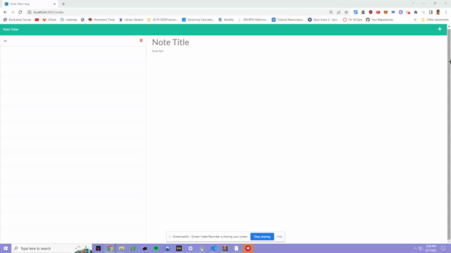

## Description

A better Note Taker using Express.js that can be used to write and save notes. This application will use an Express.js back end and will save and retrieve note data from a JSON file with Heroku.

## Installation

**HAVING NODE.JS INSTALLED IS A REQUIREMENT FOR THIS APPLICATION TO WORK!**

1. Download all files from the repository.
2. CD into the repository.
3. Run this command to install all dependancies
```md
npm install
```
4. Run this command to run the application
```md
node server.js
```

## Screenshots and Video Link of application




### **Links**

[Link to the code repository](https://github.com/kylepng/note-taker)


## Credits

* Kyle Kumar 
